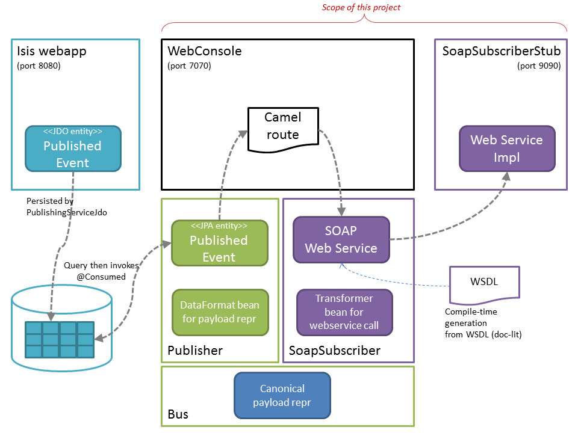

Camel Subscriber for Isis' PublishingService
===============================

An [Apache Camel](http://camel.apache.org)-based subscriber of events published by the [Apache Isis](http://isis.apache.org) [JDO Objectstore](http://isis.apache.org/components/objectstores/jdo/about.html)'s [implementation](http://isis.apache.org/components/objectstores/jdo/publishing-service-jdo.html) of Isis' own [PublishingService](http://isis.apache.org/core/services/publishing-service.html) API.

Contents:
* design
* pretty picture
* running the stuff

## Design

There are two modules that make up this project:

* webconsole

  This is Camel running within a webapp, in effect the "bus"

  This defines a route which uses a JPA source to poll
  for events from the SQL Server `PUBLISHEDEVENT` table
  (as persisted to by the Isis `PublishingServiceJdo` service).  

  The JPA entity is also called `PublishedEvent`.

  The Camel route currently just writes the event to stdout.  Eventually this will be changed to call a SOAP web service, to whit:

* cxf-target

  Currently this is just a CXF example app, running a
  SOAP web service generated from a WSDL.

  The intention is for this to evolve into a test stub service, and for the Camel route to call this SOAP web service.

The Camel route can be found in `webconsole/src/main/webapp/WEB-INF/applicationContext.xml` (in the `<camelContext>` element).

## Diagram

The above as a pretty picture:

## Running

To run the webconsole, just use

<pre>
  cd webconsole
  mvn clean package jetty:run
</pre>

Note that this cannot (easily) be run from the IDE because of the OpenJPA enhancement process that is required.

You can also run the CXF target (though this isn't yet wired up to the Camel route within the webconsole).

<pre>
  cd cxf-target
  mvn test -P server
</pre>

You can test invoke service using:

<pre>
  cd cxf-target
  mvn test -P server
</pre>

